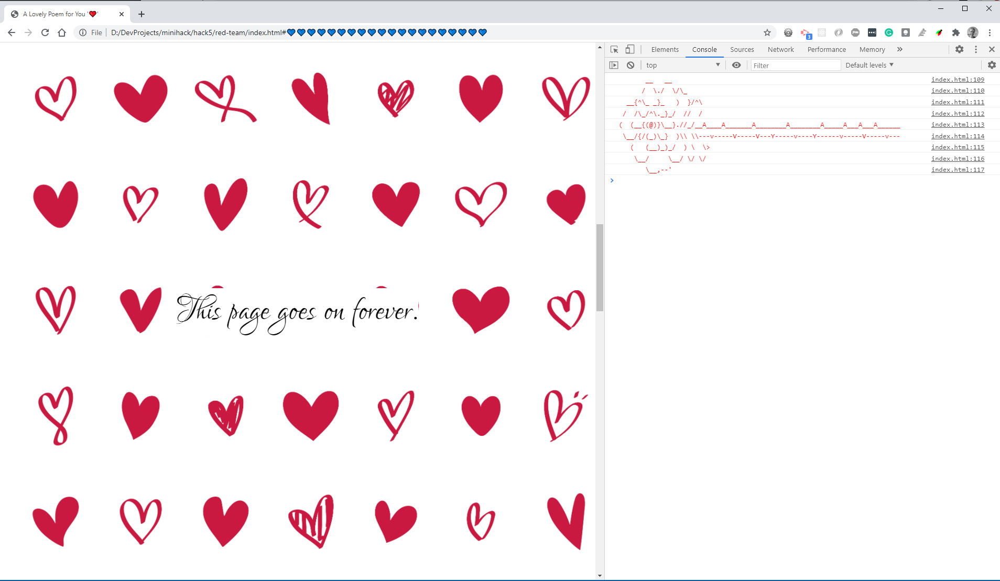

# Task

The theme for MiniHack 5 is Valentines Day.  Your friend has forgotten about valentines day - since we're in lockdown (or at least we were when I came up with this), they want you to help them out by creating a virtual valentines card or gift.

Whatever you produce must either be virtual (i.e. transmittable by e-mail), or small enough to fit in a jiffy bag.

## Team Members
@blueboxes  
@ljdyer  
Andrew

## Our Solution 
To create a web based love poem with audio, url animation and console images.

