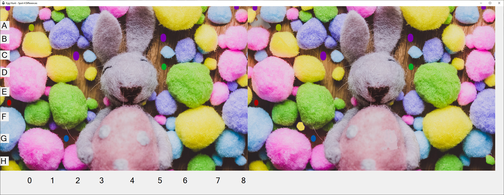
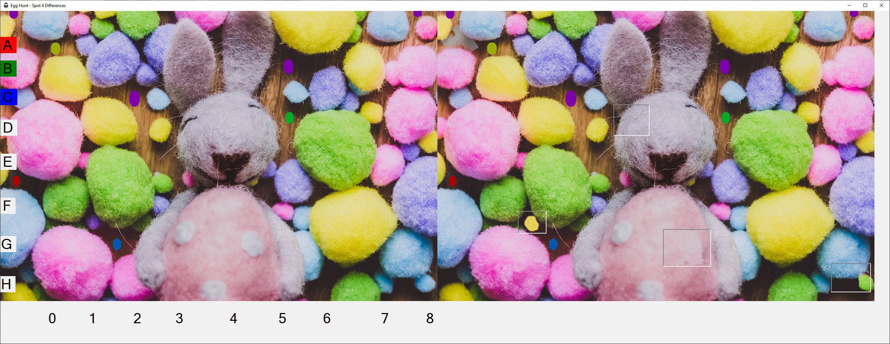

# Task

The theme for MiniHack 6 is Easter.  The task this month is to create an "Easter Egg" hunt.  

An Easter Egg (as far as a computer program or game is concerned) is something in the program that is unexpected and hidden.  You should hide as many easter eggs as you can around; however, there should be subtle hints and clues as to where the next one can be found.

## Team Members
@blueboxes  
????
????

## Our Solution 
To create a winforms based spot the difference with 4 differences and 3 easter eggs

* Find the co-ordinates in the picture to reveal colour code
* Click the items in the colour sequence to reveal the surprise image
* Click every 10 times then it tells you to stop

