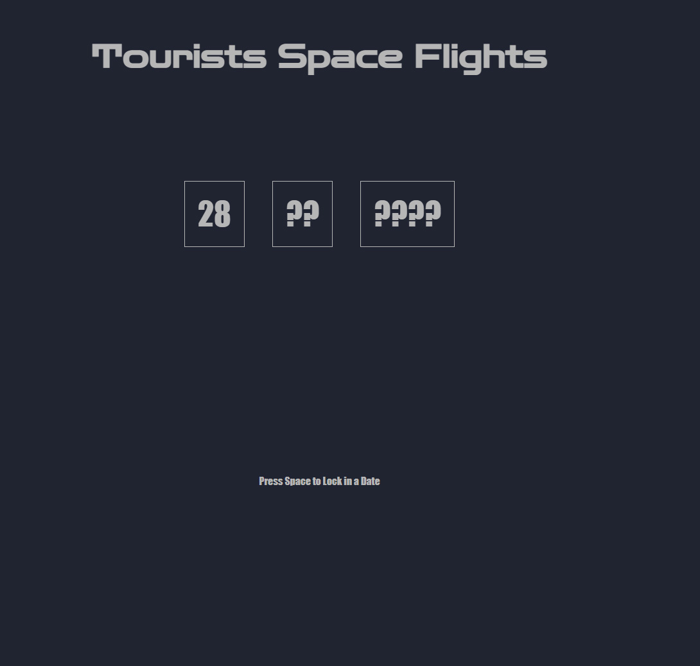
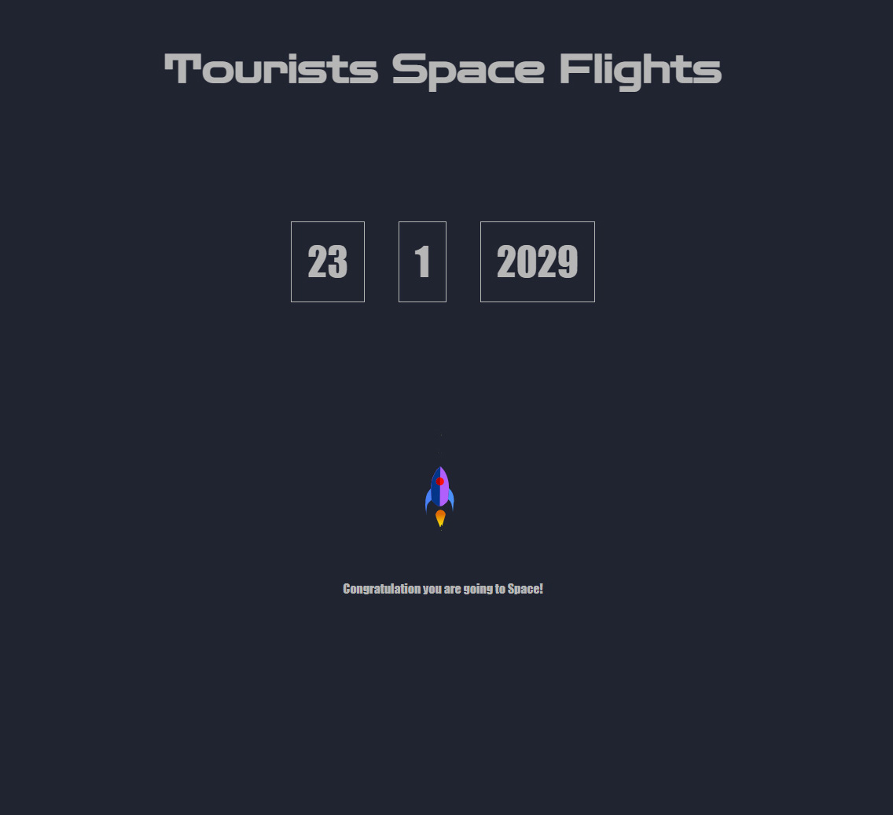
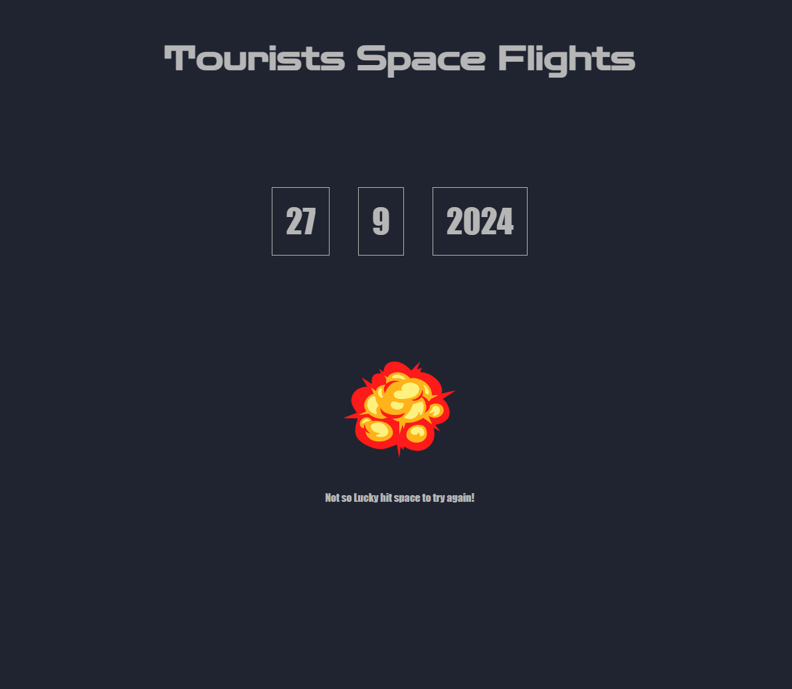

# Task

The theme for MiniHack 7 is Space.  The task this month is to create a space travel booking system.  

You've just joined a company that specialises in booking space flights for tourists.  Your task is to create a system that allows your customers to book a space flight.

## API Woes

Unfortunately, the API system is not very good, and only allows you to query for a specific date, returning a flag to say whether that date is available or not.  Worse, the API availability check crashes at a rate of 1 in 5 calls.

If you call the book method without having the correct date, that will crash, too.

## Team Members
@blueboxes  
@benza435
petar

## Our Solution 
Select date at random but hitting space bar to halt on a set date. After it checks the API to see if you can book or not.

The API failures were not all caught but it worked most of the time.

To run it use node http-server

