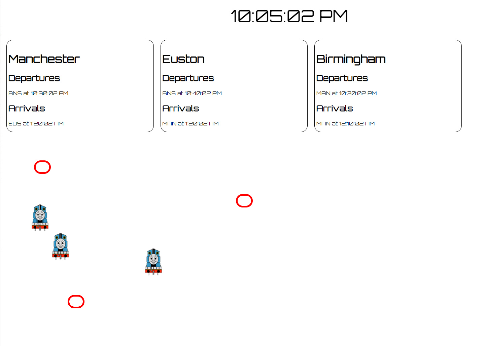

# Task

The theme for mini Hack 8 is trains.

The task is to create a system that manages train schedules based on the following information:

Station: MAN
Time to EUS: 2' 10"
Time to BNS: 1' 30"

Station: EUS
Time to MAN: 2' 10"
Time to BNS: 1' 40"

Station: BNS
Time to MAN: 1' 30"
Time to EUS: 1' 40"

One in every 5 journeys is delayed by more than 10", and one in every 20 journeys is delayed by more than 30"

2,000 people per hour travel between Birmingham and London

3,000 people per hour travel between London and Manchester

1,500 people per hour travel between Manchester and Birmingham

## Team Members
@blueboxes  
@pgillett

## Our Solution 
A simulator showing trains and times between points.

To run use `npx server`

 