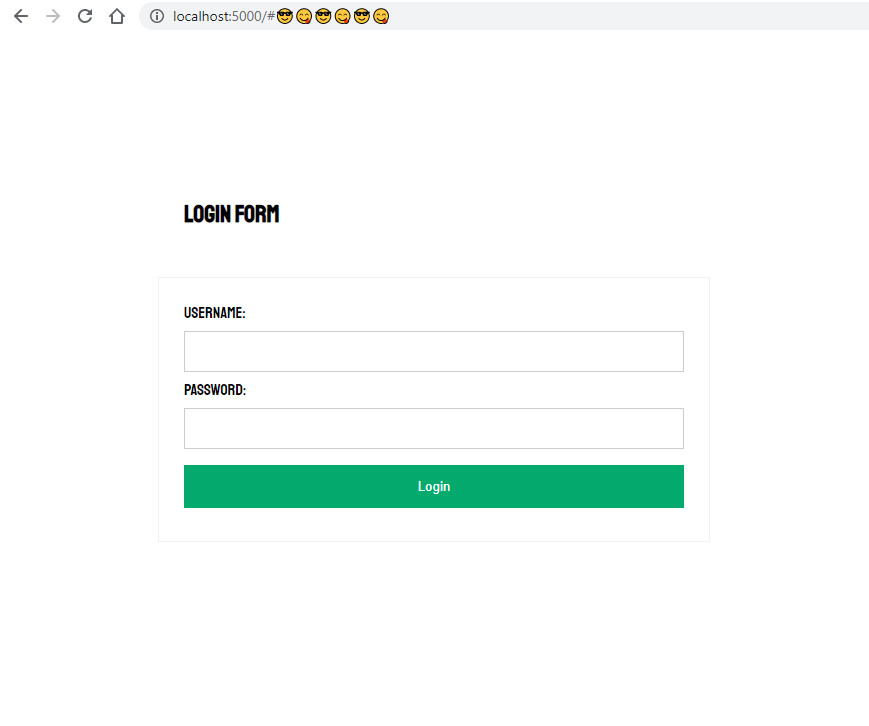

# Task

The theme for Hack 9 is security.  You have been approached by a gang of criminals, who would like you to build a backdoor into the code that you're currently producing.

The task is to create an application which performs a simple function: adds two numbers together.  The program must be secured in some way (e.g. password, MFA, biometrics, voice recognition).

You then need to leave a series of "back doors" into the program: the more subtle, the better.

## Team Members
@blueboxes  
@amgc3  
@benza435  
@calcostanza  

## Our Solution 
A password backdoor that uses the [Konami Code](https://en.wikipedia.org/wiki/Konami_Code) to skip the login. Enter the code then the URL bar will get emojis. Once you hit enter on this new url you are logged in.

!!!! Note this code is not secure and is built for fun. NEVER use any of this code to create a login.

To run use `npx server`

 